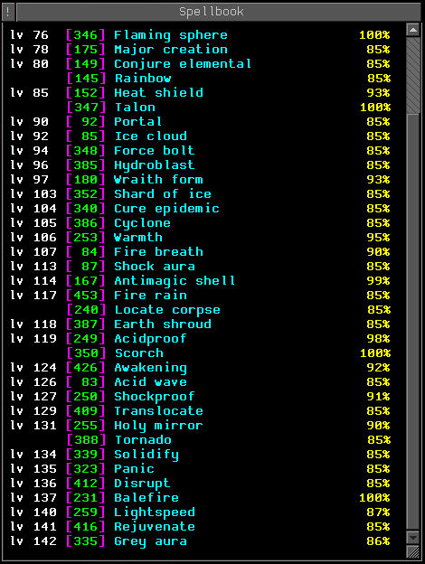

# Spellbook Aardwolf Plugin

Lists all spells in a sticky window for reference

Example:



## Installation

1. Download [Spellbook.xml](Spellbook.xml), place it somewhere it wouldn't move (e.g. the plugins
   directory in your MUSHClient installation)
1. Open Plugin Manager (Ctrl+Shift+P)
1. Add `Spellbook.xml` via the plugin manager

## Usage

1. This replaces your regular spells command. Use one of sp, spe, spel, spell, spells aliases to
   load the spell list into a floating window.
1. Click a spell to cast it. You must have an active target as the cast command will be immediately
   sent to the world.
1. You can move & resize the window as you wish
1. Adding any modifier to the spells command will use the regular spell output. This is useful for
   one-time lookups of the next spells, or spells in a certain level range.

### Aliases/Commands

Use `spw help` to see this list at any time in the game.

```
Spellbook window commands
------
spw enable                  - Enable spellbook
spw disable                 - Disable spellbook
spw hide <spell id>         - Hide spell from spellbook
spw unhide <spell id>       - Unhide spell from spellbook
spw hidden                  - List hidden spells
```
